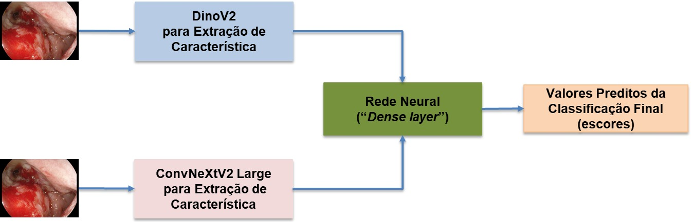
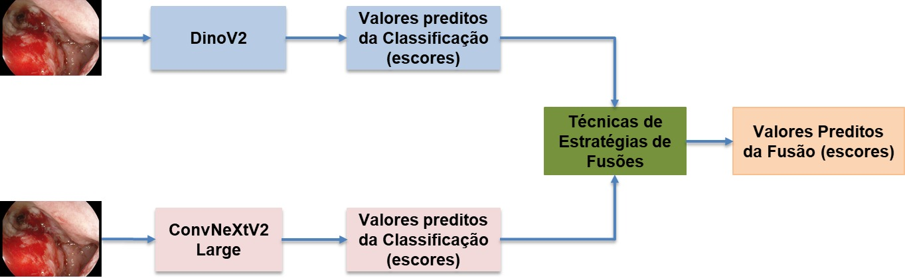

# Gastrointestinal-Classification
#### Aluno: Gledson Melotti (https://github.com/gledsonmelotti/Gastrointestinal-Classification).
#### Orientadora: Manoela Kohler (https://github.com/manoelakohler).
---

Trabalho apresentado ao curso de Especialização: "Visão Computacional: Interpretando o Mundo Através de Imagens - Computer Vision Master" em nível de Pós-Graduação "Lato Sensu" (https://ica.ele.puc-rio.br/cursos/computer-vision-master/) como pré-requisito para conclusão de curso.

- [Link para o código: redes neurais indviduais](Individual_Result).
- [Link para o código: *late fusion* com dois modelos](Late_Fusion_2_Model_result).
- [Link para o código: *late fusion* com três modelos](Late_Fusion_3_Model_result).
- [Link para o código: *late fusion* com três modelos](Intermediate_Fusion_Result).
- [Link para o código: Trabalho e PDF](PDF-project).

---

## Resumo

O reconhecimento automatizado de trato gastrointestinal a partir de imagens endoscópicas têm se tornado uma área promissora com o avanço dos algoritmos de inteligência artificial (IA), como redes neurais artificiais são algoritmos que tem apresentado resultados satisfatórios na distinção entre imagens com e sem lesões ou doenças no trato gastrointestinal, identificando padrões visuais complexos que às vezes não são reconhecidos pela percepção médica tradicional. As aplicações dessas técnicas contribuíram para diagnósticos mais rápidos, padronizados e confiáveis, especialmente em contextos clínicos com alta demanda ou escassez de especialistas. Assim, o uso de IA na classificação de imagens gastrointestinais representa um importante avanço para o diagnóstico precoce e a melhoria do prognóstico de doenças do trato digestivo. Dito de outro modo, os resultados de tais algoritmos facilitam intervenções médicas para um tratamento específico. Assim, com o objetivo de contribuir para a melhoria dos resultados de classificação de imagens dos tratos gastrointestinais, este trabalho propôs estratégias de fusões para melhorar os resultados individuais dos algoritmos de inteligência artificial. Os resultados foram avaliados pelas métricas acurácias, sensibilidade, especificidade, precisão, taxa de falsos positivos, F-escore, coeficiente de correlação de Matthews, Kappa e áreas sob as curvas da Característica de Operação do Receptor e da Precisão-Sensibilidade.

## Abstract

Automated recognition of the gastrointestinal tract from endoscopic images has become a promising area with the advancement of artificial intelligence (AI) algorithms, as artificial neural networks are algorithms that have shown satisfactory results in distinguishing between images with and without lesions or diseases in the gastrointestinal tract, identifying complex visual patterns that are sometimes not recognized by traditional medical perception. The applications of these techniques have contributed to faster, more standardized, and more reliable diagnoses, especially in clinical contexts with high demand or a shortage of specialists. Thus, the use of AI in the classification of gastrointestinal images represents an important advance for the early diagnosis and improved prognosis of diseases of the digestive tract. In other words, the results of such algorithms facilitate medical interventions for specific treatment. Therefore, with the aim of contributing to the improvement of gastrointestinal image classification results, this work proposed fusion strategies to improve the individual results of artificial intelligence algorithms. The results were evaluated using the metrics accuracy, sensitivity, specificity, precision, false positive rate, F-score, Matthews correlation coefficient, Kappa, and the areas under the Receiver Operating Characteristic and Precision-Recall curves.

## 1.0 Introdução e Justificativa

O estilo de vida moderno e hábitos alimentares inadequados têm contribuído para o aumento das infecções e doenças gastrointestinais. Úlceras, pólipos, inflamações, cânceres no esôfago, estômago e cólon representam uma parcela significativa dos novos diagnósticos e mortes anuais, frequentemente associados a condições como úlceras, sangramentos e pólipos. A detecção precoce dessas infecções e doenças é possível com observações de especialistas, mas pequenos tratos costumam passar despercebidos em exames iniciais, muitas vezes devido às limitações dos métodos endoscópicos tradicionais e erros humanos [1-3].

Com o avanço da inteligência artificial (IA), os algoritmos de aprendizado de máquinas, como as redes neurais convolucionais (CNN do inglês “Convolutional Neural Networks”) [4-6], têm demonstrado alto desempenho na análise de imagens médicas [7-11]. Tais algoritmos contribuíram com o desenvolvimento de soluções acessíveis e reprodutíveis, com a finalidade de auxiliar endoscopistas na identificação de anomalias com maior precisão [12-13], que contribuiu para diagnósticos mais precoces, tratamentos mais eficazes, redução de custos e alívio da pressão sobre os sistemas de saúde [14-16], especialmente diante da projeção de aumento global de doenças gastrointestinais [17-18].

Além de aumentar a confiabilidade dos diagnósticos, as técnicas de inteligência artificial permitem o desenvolvimento de sistemas assistivos que podem auxiliar profissionais da saúde durante procedimentos clínicos ou triagens em ambientes com escassez de especialistas, bem como reduzir o tempo de análise das imagens gastrointestinais e contribuindo para o reconhecimento precoce de doenças gastrointestinais e, consequentemente, para melhores prognósticos e planos terapêuticos [7-18].

## 2.0 Objetivos

### 2.1  Objetivo geral

Este projeto tem como finalidade aperfeiçoar os resultados individuais obtidos das predições de classificações de doenças gastrointestinais [19], a utilizar estratégias de fusões intermediária (intermediate fusion) [20-22] e fusões tardias/posteriores (late fusion) [23-26].

### 2.2 Objetivos específicos

- Estudar as predições individuais obtidas a partir das redes neurais convolucionais EfficientNetV2-Medium [27] e ConvNeXtV2-Large [28], bem como a rede neural transformadora DinoV2 [29].
- Apresentar estratégias de fusões tardias usando as predições individuais das classificações da EfficientNetV2-Medium [27], ConvNeXtV2-Large [28] e DinoV2 [29] a partir do dataset de teste.
- Mostrar as estratégias de fusões intermediárias, ao combinar os resultados das camadas intermediárias das redes neurais ConvNeXtV2-Large [28] com DinoV2 [29], DinoV2 [29] com EfficientNetV2-Medium [27], ConvNeXtV2-Large [28] com EfficientNetV2-Medium [27] e por último a fusão das redes EfficientNetV2-Medium [27] com ConvNeXtV2-Large [28] com DinoV2 [29].
- Os resultados das estratégias de fusões serão avaliados pelas métricas de classificação acurácia, sensibilidade, especificidade, precisão, taxa de falsos positivos, F-escore, coeficiente de correlação de Matthews, Kappa e áreas sob as curvas da Característica de Operação do Receptor e da Precisão-Sensibilidade.

## 3. Estratégias de Fusões

### 3.1. Estratégia *Intermediate Fusion*

Na abordagem *Intermediate Fusion*, as imagens do *dataset* de treino passam pelas redes neurais para extração de características e, posteriormente, as características são concatenadas e processadas por uma outra rede neural, que gera os escores preditivos da classificação final [20-22], conforme a Figura 1.

**Figura 1:** Representação da estratégia *intermediate fusion*, a usar a mesma imagem do gastrointestinal [19] como entrada para cada modelo de *Deep Learning*, com a finalidade de extrair características. Tais características são concatenadas e inseridas em uma nova rede neural.

### 3.2. Estratégia *Late Fusion*

Diferentemente da estratégia *intermediate fusion*, a estratégia *late fusion* é a combinação dos resultados de predições com o *dataset* de teste das classificadores individuais já treinados com o *dataset* de treino [23-26].

**Figura 2:** Representação da estratégia *late fusion*, a usar uma mesma imagem do *dataset* gastrointestinal [19] como entrada para cada modelo de *Deep Learning*, que fornecem os escores preditos das classificações individuais. Tais escores são agrupados por alguma estratégia de fusão tardia.

Matematicamente, tais combinações dos escores podem ser definidas como o valor médio, máximo, mínimo e produto normalizado (ProNor) dos modelos de *deep learning*, conforme as equações (1), (2), (3) e (4) respectivamente [30-33]:

## 4.0 Resultados e Discussões

## 4. Resultados e Discussões

No contexto da presente pesquisa, algoritmos de redes neurais podem contribuir para a predição de doenças do trato gastrointestinal. No entanto, deve-se buscar qual arquitetura de redes neurais que mais se adapta no contexto do problema. Diante disso, o principal objetivo da pesquisa foi avaliar e comparar o desempenho de três diferentes arquiteturas para obter os resultados das classificações. Tal comparação foi realizada por meio de diferentes métricas de classificação em reconhecimento de padrões, como acurácia, sensibilidade ou do inglês *recall*, também definido como *True Positive Rate* - TPR, especificidade, precisão, taxa de falsos positivos (do inglês *False Positive Rate* - FPR), F-escore, coeficiente de correlação de Matthews e coeficiente Kappa, as áreas sob as curvas (do inglês *Area Under the Curve* – AUC) de Precisão-Sensibilidade (do inglês *Precision-Recall* – PR), com *Threshold* otimizado pelo F1-score máximo e Característica de Operação do Receptor (do inglês *Receiver Operating Characteristic* – ROC), com *Threshold* otimizado pelo índice de Youden. Tais métricas têm a finalidade de auxiliar no diagnóstico médico das doenças que surgem no gastrointestinal.

### 4.1 Estratégia *Intermediate Fusion*

**Tabela 1:** Métricas de classificação para a classe *lesion*.

| Métrica | DINOv2 Fine-tuning | ConvNeXtV2-L Fine-tuning | EfficientNetV2-M Fine-tuning | Fusão ConvNeXtV2-L + DinoV2 | Fusão ConvNeXtV2-L + EfficientNetV2-M | Fusão DinoV2 + EfficientNetV2-M | Fusão ConvNeXtV2-L + DinoV2 + EfficientNetV2-M |
|---|---|---|---|---|---|---|---|
| TP | 19 | 19 | 17 | 19 | 19 | 19 | 19 |
| FP | 4 | 3 | 0 | 2 | 0 | 2 | 1 |
| FN | 3 | 3 | 5 | 3 | 3 | 3 | 3 |
| TN | 18 | 19 | 22 | 20 | 22 | 20 | 21 |
| Acurácia | 0.8409 | 0.8636 | 0.8864 | 0.8864 | 0.9318 | 0.8864 | 0.9091 |
| Sensibilidade (*Recall*) | 0.8636 | 0.8636 | 0.7727 | 0.8636 | 0.8636 | 0.8636 | 0.8636 |
| Especificidade | 0.8182 | 0.8636 | 1.0000 | 0.9091 | 1.0000 | 0.9091 | 0.9545 |
| Precisão | 0.8261 | 0.8636 | 1.0000 | 0.9048 | 1.0000 | 0.9048 | 0.9500 |
| Taxa de Falsos Positivos | 0.1818 | 0.1364 | 0.0000 | 0.0909 | 0.0000 | 0.0909 | 0.0455 |
| Escore F1 | 0.8444 | 0.8636 | 0.8718 | 0.8837 | 0.9268 | 0.8837 | 0.9048 |
| Coeficiente de Correlação de Matthews | 0.6825 | 0.7273 | 0.7935 | 0.7735 | 0.8718 | 0.7735 | 0.8216 |
| Coeficiente Kappa | 0.6818 | 0.7273 | 0.7727 | 0.7727 | 0.8636 | 0.7727 | 0.8182 |
| Área sob a curva - ROC | 0.9483 | 0.9483 | 0.9514 | 0.9607 | 0.9835 | 0.9525 | 0.9649 |
| Limiar da Curva ROC | 0.9307 | 0.7671 | 0.3159 | 0.8359 | 0.4849 | 0.5459 | 0.8804 |
| Precisão Média (Área sob a Curva Precisão-Revocação) | 0.9581 | 0.9530 | 0.9668 | 0.9678 | 0.9857 | 0.9586 | 0.9704 |
| Limiar da Curva Precisão-Revocação | 0.7114 | 0.3462 | 0.0562 | 0.6147 | 0.4849 | 0.5459 | 0.5947 |

 

**Tabela 2:** Métricas de classificação para a classe *normal*.

| Métrica | DINOv2 Fine-tuning | ConvNeXtV2-L Fine-tuning | EfficientNetV2-M Fine-tuning | Fusão ConvNeXtV2-L + DinoV2 | Fusão ConvNeXtV2-L + EfficientNetV2-M | Fusão DinoV2 + EfficientNetV2-M | Fusão ConvNeXtV2-L + DinoV2 + EfficientNetV2-M |
|---|---|---|---|---|---|---|---|
| TP | 18 | 19 | 22 | 20 | 22 | 20 | 21 |
| FP | 3 | 3 | 5 | 3 | 3 | 3 | 3 |
| FN | 4 | 3 | 0 | 2 | 0 | 2 | 1 |
| TN | 19 | 19 | 17 | 19 | 19 | 19 | 19 |
| Acurácia | 0.8409 | 0.8636 | 0.8864 | 0.8864 | 0.9318 | 0.8864 | 0.9091 |
| Sensibilidade (*Recall*) | 0.8182 | 0.8636 | 1.0000 | 0.9091 | 1.0000 | 0.9091 | 0.9545 |
| Especificidade | 0.8636 | 0.8636 | 0.7727 | 0.8636 | 0.8636 | 0.8636 | 0.8636 |
| Precisão | 0.8571 | 0.8636 | 0.8148 | 0.8696 | 0.8800 | 0.8696 | 0.8750 |
| Taxa de Falsos Positivos | 0.1364 | 0.1364 | 0.2273 | 0.1364 | 0.1364 | 0.1364 | 0.1364 |
| Escore F1 | 0.8372 | 0.8636 | 0.8980 | 0.8889 | 0.9362 | 0.8889 | 0.9130 |
| Coeficiente de Correlação de Matthews | 0.6825 | 0.7273 | 0.7935 | 0.7735 | 0.8718 | 0.7735 | 0.8216 |
| Coeficiente Kappa | 0.6818 | 0.7273 | 0.7727 | 0.7727 | 0.8636 | 0.7727 | 0.8182 |
| Área sob a curva - ROC | 0.9483 | 0.9483 | 0.9514 | 0.9607 | 0.9835 | 0.9525 | 0.9649 |
| Limiar da Curva ROC | 0.4409 | 0.8867 | 0.9619 | 0.4570 | 0.5615 | 0.5664 | 0.5386 |
| Precisão Média (Área sob a Curva Precisão-Revocação) | 0.9485 | 0.9519 | 0.9180 | 0.9608 | 0.9838 | 0.9549 | 0.9655 |
| Limiar da Curva Precisão-Revocação | 0.0668 | 0.3418 | 0.7495 | 0.2114 | 0.5615 | 0.5664 | 0.2267 |

### 4.2 Estratégia *Late Fusion*

**Tabela 3:** Métricas de classificação para a classe *lesion*.

| Métrica | DINOv2 Fine-tuning | ConvNeXtV2-L Fine-tuning | EfficientNetV2-M Fine-tuning | Fusão ConvNeXtV2-L + DinoV2 | Fusão ConvNeXtV2-L + EfficientNetV2-M | Fusão DinoV2 + EfficientNetV2-M | Fusão ConvNeXtV2-L + DinoV2 + EfficientNetV2-M |
|---|---|---|---|---|---|---|---|
| TP | 19 | 19 | 17 | 19 | 18 | 18 | 20 |
| FP | 4 | 3 | 0 | 4 | 0 | 0 | 1 |
| FN | 3 | 3 | 5 | 3 | 4 | 4 | 2 |
| TN | 18 | 19 | 22 | 18 | 22 | 22 | 21 |
| Acurácia | 0.8409 | 0.8636 | 0.8864 | 0.8409 | 0.9091 | 0.9091 | 0.9318 |
| Sensibilidade (*Recall*) | 0.8636 | 0.8636 | 0.7727 | 0.8636 | 0.8182 | 0.8182 | 0.9091 |
| Especificidade | 0.8182 | 0.8636 | 1.0000 | 0.8182 | 1.0000 | 1.0000 | 0.9545 |
| Precisão | 0.8261 | 0.8636 | 1.0000 | 0.8261 | 1.0000 | 1.0000 | 0.9524 |
| Taxa de Falsos Positivos | 0.1818 | 0.1364 | 0.0000 | 0.1818 | 0.0000 | 0.0000 | 0.0455 |
| Escore F1 | 0.8444 | 0.8636 | 0.8718 | 0.8444 | 0.9000 | 0.9000 | 0.9302 |
| Coeficiente de Correlação de Matthews | 0.6825 | 0.7273 | 0.7935 | 0.6825 | 0.8321 | 0.8321 | 0.8645 |
| Coeficiente Kappa | 0.6818 | 0.7273 | 0.7727 | 0.6818 | 0.8182 | 0.8182 | 0.8636 |
| Área sob a curva - ROC | 0.9483 | 0.9483 | 0.9514 | 0.9566 | 0.9773 | 0.9711 | 0.9711 |
| Limiar da Curva ROC | 0.9307 | 0.7671 | 0.3159 | 0.6689 | 0.5256 | 0.5054 | 0.6450 |
| Precisão Média (Área sob a Curva Precisão-Revocação) | 0.9581 | 0.9530 | 0.9668 | 0.9643 | 0.9795 | 0.9751 | 0.9768 |
| Limiar da Curva Precisão-Revocação | 0.7114 | 0.3462 | 0.0562 | 0.6689 | 0.1609 | 0.4500 | 0.5557 |

 

**Tabela 4:** Métricas de classificação para a classe *normal*.

| Métrica | DINOv2 Fine-tuning | ConvNeXtV2-L Fine-tuning | EfficientNetV2-M Fine-tuning | Fusão ConvNeXtV2-L + DinoV2 | Fusão ConvNeXtV2-L + EfficientNetV2-M | Fusão DinoV2 + EfficientNetV2-M | Fusão ConvNeXtV2-L + DinoV2 + EfficientNetV2-M |
|---|---|---|---|---|---|---|---|
| TP | 19 | 19 | 17 | 18 | 22 | 22 | 21 |
| FP | 4 | 3 | 0 | 3 | 4 | 4 | 2 |
| FN | 3 | 3 | 5 | 4 | 0 | 0 | 1 |
| TN | 18 | 19 | 22 | 19 | 18 | 18 | 20 |
| Acurácia | 0.8409 | 0.8636 | 0.8864 | 0.8409 | 0.9091 | 0.9091 | 0.9318 |
| Sensibilidade (*Recall*) | 0.8636 | 0.8636 | 0.7727 | 0.8182 | 1.0000 | 1.0000 | 0.9545 |
| Especificidade | 0.8182 | 0.8636 | 1.0000 | 0.8636 | 0.8182 | 0.8182 | 0.9091 |
| Precisão | 0.8261 | 0.8636 | 1.0000 | 0.8571 | 0.8462 | 0.8462 | 0.9130 |
| Taxa de Falsos Positivos | 0.1818 | 0.1364 | 0.0000 | 0.1364 | 0.1818 | 0.1818 | 0.0909 |
| Escore F1 | 0.8444 | 0.8636 | 0.8718 | 0.8372 | 0.9167 | 0.9167 | 0.9333 |
| Coeficiente de Correlação de Matthews | 0.6825 | 0.7273 | 0.7935 | 0.6825 | 0.8321 | 0.8321 | 0.8645 |
| Coeficiente Kappa | 0.6818 | 0.7273 | 0.7727 | 0.6818 | 0.8182 | 0.8182 | 0.8636 |
| Área sob a curva - ROC | 0.9483 | 0.9483 | 0.9514 | 0.9566 | 0.9773 | 0.9711 | 0.9711 |
| Limiar da Curva ROC | 0.9307 | 0.7671 | 0.3159 | 0.3914 | 0.8740 | 0.5383 | 0.5451 |
| Precisão Média (Área sob a Curva Precisão-Revocação) | 0.9581 | 0.9530 | 0.9668 | 0.9566 | 0.9785 | 0.9718 | 0.9701 |
| Limiar da Curva Precisão-Revocação | 0.7114 | 0.3462 | 0.0562 | 0.3914 | 0.5003 | 0.5239 | 0.3931 |

## Conclusões

A implementação de modelos avançados de inteligência artificial, que integram diversas formulações matemáticas, proporcionaram diagnósticos mais precisos e confiáveis, conforme pode ser analisado por meio das métricas de classificações, principalmente com relação à sensibilidade e as áreas das curvas Característica de Operação do Receptor e Precisão-Sensibilidade, reduzindo em algumas estratégias a incidência de falsos positivos e falsos negativos, o que é crucial para tratamentos médicos eficazes e adequados.

Além da validação dos resultados por meio das métricas, não se pode deixar de evidenciar que os modelos utilizados foram rigorosamente testados e validados em conjuntos de dados reais, garantindo sua aplicabilidade e robustez em cenários clínicos reais. 

A validação e a comprovação da eficácia das soluções baseadas em IA devem promover maior aceitação e confiança por parte dos profissionais da área da saúde, fortalecendo a confiança em inteligência artificial. Entretanto, as arquiteturas de redes neurais atuam como suporte complementar aos médicos, contribuindo para decisões clínicas mais precisas e reduzindo a sobrecarga em locais com escassez de profissionais especializados em doenças do gastrointestinal. Como consequência, os pacientes se beneficiam com diagnósticos mais rápidos e assertivos, o que pode resultar em tratamentos mais eficazes e personalizados. Além disso, o aumento da precisão tende a reduzir despesas decorrentes de tratamentos ineficazes ou desnecessários, além de evitar hospitalizações prolongadas.

Com os resultados obtidos é possível demonstrar não apenas os avanços significativos das arquiteturas de redes neurais empregadas, mas também na possível otimização da qualidade assistencial e nos desfechos clínicos dos pacientes.

## Referências

## Referências

[1] C. Xia et al., "Effect of an Endoscopy Screening on Upper Gastrointestinal Cancer Mortality: A Community-Based Multicenter Cluster Randomized Clinical Trial," *Gastroenterology*, vol. 168, no. 4, pp. 725–740, 2025.

[2] F. Abushamat et al., "Traction-Assisted Endoscopic Submucosal Dissection of Colonic Lesions: A North American Experience," *Techniques and Innovations in Gastrointestinal Endoscopy*, vol. 27, no. 1, art. no. 250901, 2025.

[3] N. M. McDonald et al., "Practice Patterns of Endoscopists Performing Endoscopic Gallbladder Drainage," *Techniques and Innovations in Gastrointestinal Endoscopy*, vol. 25, no. 3, pp. 221–227, 2023.

[4] G. James, D. Witten, T. Hastie, and R. Tibshirani, *An Introduction to Statistical Learning: With Applications in R*. New York: Springer, 2013.

[5] I. Goodfellow, Y. Bengio, and A. Courville, *Deep Learning*. Cambridge, MA: MIT Press, 2016.

[6] C. M. Bishop, *Pattern Recognition and Machine Learning*. New York: Springer, 2006.

[7] A. Divekar, A. Sonwane, A. Swami, and S. Bhagwat, "Detection of Gastrointestinal Bleeding in WCE Images Using YOLOv5," in *Intelligent Systems (ICMIB 2024)*, S. Kumar Udgata, S. Sethi, G. Ghinea, and S. K. Kuanar, Eds., Lecture Notes in Networks and Systems, vol. 1149. Singapore: Springer, 2024.

[8] X. Jia and M. Q.-H. Meng, "Gastrointestinal Bleeding Detection in Wireless Capsule Endoscopy Images Using Handcrafted and CNN Features," in *Proc. 39th Annu. Int. Conf. IEEE Engineering in Medicine and Biology Society (EMBC)*, Jeju, South Korea, 2017, pp. 3154–3157.

[9] A. J. Breitkopf, R. Arun, and R. Jeya, "Exploring Emerging Technologies for Gastrointestinal Cancer Diagnosis," in *Proc. Int. Conf. Advances in Computing, Communication and Applied Informatics (ACCAI)*, Chennai, India, 2024, pp. 1–6.

[10] R. M. Patil and S. Giripunje, "Deep Learning-Based Detection and Classification of Gastrointestinal Tract Diseases in Endoscopy Images," in *Proc. 2nd DMIHER Int. Conf. Artificial Intelligence in Healthcare, Education and Industry (IDICAIEI)*, Wardha, India, 2024, pp. 1–6.

[11] Y. Li et al., "Detection of Exhaled Methane in Gastrointestinal Disease Population Based on TDLAS," *IEEE Sensors Journal*, vol. 24, no. 19, pp. 31095–31103, 2024.

[12] R. Uma, G. K., S. P., and M. K. M., "A Deep Learning Based Detection and Classification of Gastrointestinal Diseases," in *Proc. 6th Int. Conf. Electrical, Control and Instrumentation Engineering (ICECIE)*, Pattaya, Thailand, 2024, pp. 1–7.

[13] K. Pogorelov et al., "KVASIR: A Multi-Class Image Dataset for Computer Aided Gastrointestinal Disease Detection," in *Proc. 8th ACM Multimedia Systems Conf. (MMSYS)*, Taipei, Taiwan, 2017, pp. 164–169.

[14] A. F. Peery et al., "Burden and Cost of Gastrointestinal, Liver, and Pancreatic Diseases in the United States: Update 2024," *Gastroenterology*, vol. 168, no. 5, pp. 1000–1024, May 2025.

[15] A. Peery et al., "Burden and Cost of Gastrointestinal, Liver, and Pancreatic Diseases in the United States: Update 2021," *Gastroenterology*, vol. 162, pp. 621–644, 2021.

[16] A. Turcu-Știolică, M. Dimitrova, and M. Jinga, "Editorial: Advances in the Potential Treatments of Gastrointestinal and Liver Diseases: Addressing the Public Health Burden," *Frontiers in Pharmacology*, vol. 14, 2023.

[17] Z. Bai, H. Wang, C. Shen, J. An, Z. Yang, and X.-M. Mo, "The Global, Regional, and National Patterns of Change in the Burden of Nonmalignant Upper Gastrointestinal Diseases from 1990 to 2019 and the Forecast for the Next Decade," *International Journal of Surgery (London, England)*, vol. 111, pp. 80–92, 2024.

[18] L. Mo, Z. Liu, W. Cao, H. Gong, J. Wu, M. Lin, and W. Pan, "Global, Regional, and National Burden of Gastroesophageal Reflux Disease (1990–2021): Age-Period-Cohort Analysis and Bayesian Projections," *Frontiers in Public Health*, vol. 13, 2025.

[19] A. Khan and H. Malik, "Gastrointestinal Bleeding WCE Images Dataset," *Mendeley Data*, V1, 2023.

[20] A. Pareek, S. Seyyedi, I. Banerjee, and M. Lungren, "Fusion of Medical Imaging and Electronic Health Records Using Deep Learning: A Systematic Review and Implementation Guidelines," *NPJ Digital Medicine*, vol. 3, 2020.

[21] S. Stahlschmidt, B. Ulfenborg, and J. Synnergren, "Multimodal Deep Learning for Biomedical Data Fusion: A Review," *Briefings in Bioinformatics*, vol. 23, 2022.

[22] F. Zhao, C. Zhang, and B. Geng, "Deep Multimodal Data Fusion," *ACM Computing Surveys*, vol. 56, pp. 1–36, 2024.

[23] E. Morvant, A. Habrard, and S. Ayache, "Majority Vote of Diverse Classifiers for Late Fusion," in *Structural, Syntactic, and Statistical Pattern Recognition*. Berlin, Heidelberg: Springer, 2014, pp. 153–162.

[24] D. Liu, K. Lai, G. Ye, M. Chen, and S. Chang, "Sample-Specific Late Fusion for Visual Category Recognition," in *Proc. IEEE Conf. Computer Vision and Pattern Recognition (CVPR)*, 2013, pp. 803–810.

[25] A. Ashwath, M. Peechatt, C. Alm, and R. Bailey, "Early vs. Late Multimodal Fusion for Recognizing Confusion in Collaborative Tasks," in *Proc. 11th Int. Conf. Affective Computing and Intelligent Interaction Workshops and Demos (ACIIW)*, 2023, pp. 1–4.

[26] H. Mitchell, *Multi-Sensor Data Fusion*, 1st ed. Berlin: Springer-Verlag, 2010.

[27] M. Tan and Q. V. Le, "EfficientNetV2: Smaller Models and Faster Training," in *Proc. 38th Int. Conf. Machine Learning (ICML)*, Proceedings of Machine Learning Research, vol. 139, 2021, pp. 10096–10106.

[28] S. Woo, S. Debnath, R. Hu, X. Chen, Z. Liu, I. S. Kweon, and S. Xie, "ConvNeXt V2: Co-Designing and Scaling ConvNets with Masked Autoencoders," in *Proc. IEEE/CVF Conf. Computer Vision and Pattern Recognition (CVPR)*, 2023, pp. 16133–16142.

[29] M. Oquab, T. Darcet, T. Moutakanni, H. Vo, M. Szafraniec, et al., "DINOv2: Learning Robust Visual Features Without Supervision," *Transactions on Machine Learning Research*, 2024, pp. 1–31.

[30] N.-B. Chang and K. Bai, *Multisensor Data Fusion and Machine Learning for Environmental Remote Sensing*. Boca Raton, FL: CRC Press, 2018.

[31] A. Mi, L. Wang, and J. Qi, "A Multiple Classifier Fusion Algorithm Using Weighted Decision Templates," *Scientific Programming*, vol. 2016, pp. 1–10, 2016.

[32] J. Kittler, M. Hatef, R. P. Duin, and J. Matas, "On Combining Classifiers," *IEEE Transactions on Pattern Analysis and Machine Intelligence*, vol. 20, no. 3, pp. 226–239, 1998.

[33] D. M. J. Tax, R. P. W. Duin, and M. Van Breukelen, "Comparison Between Product and Mean Classifier Combination Rules," in *Proc. Workshop on Statistical Pattern Recognition*, Prague, Czech Republic, 1997.

---

Matrícula: 242.100.269

Pontifícia Universidade Católica do Rio de Janeiro

Curso de Pós Graduação *Visão Computacional Master*

